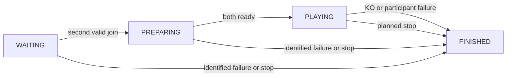

# Implementation guide

This file describes the current server boilerplate, where the team must implement
networking by hand, and how to follow the local simulation. The authoritative
requirements are [00-contexto-geral.md](00-contexto-geral.md) and
[02-boilerplate-servidor.md](02-boilerplate-servidor.md).

The match logic is implemented. TCP connections, the TVP/1 byte protocol, and
network timers are not implemented. `TODO[EP-REDE]` marks the pending boundary.

## 1. What is implemented, and how

| Feature | Code to read | How it works |
| --- | --- | --- |
| Shared message and state types | [models.py](src/tetris_shared/models.py) | Enums name the eight wire types, four match phases, outcomes, and ending reasons. Frozen dataclasses carry players, commands, output events, and results. These are Python objects, not encoded packets. |
| Common validation values | [rules.py](src/tetris_shared/rules.py) | Defines board dimensions, valid cell values, attack quantities, nickname format, and KO causes. Network limits are declared here but are not enforced by a transport yet. |
| Two identified participants | `MatchController.join()` in [match.py](src/tetris_server/match.py) | Uses two slots. Validates nickname and session, rejects duplicate identification and a third participant. Equal nicknames are allowed because the session token identifies a player. The second join produces MATCH events for both players. |
| Readiness and start | `MatchController.ready()` | Repeated readiness has no duplicate effects. Both ready players move the match to PLAYING and produce one READY event with payload `GO` per player. |
| Attack forwarding | `MatchController.attack()` | Accepts only integer 1, 2, or 4 during play, rejecting booleans. Sends the same garbage quantity to the other slot. It does not calculate line clears or apply garbage. |
| Board validation and forwarding | `MatchController._snapshot()` and `.board()` | Require 20 rows of 10 integer cells from 0 through 8. Copy into tuples, store the latest snapshot, and produce a BOARD event for the opponent. Changes to the caller's matrix cannot alter that snapshot. |
| One final result | `MatchController.ko()` and `._finish()` | The first valid ending records a frozen result and FINISHED state before producing GAMEOVER events. A valid KO during play gives the opponent WIN and the sender LOSE. Late events from known players do not create new effects. |
| Failure policies | `MatchController.failure()` and `.stop()` | Receive disconnect, timeout, and protocol-failure facts. Before play, failure cancels; during play, the opponent wins. Planned stop cancels. The domain does not detect real network failures or elapsed time. |
| Sequential command processing | `ServerApp.process()` in [app.py](src/tetris_server/app.py) | Maps a local command to a controller method, records logs, and queues returned events before accepting the next command. Domain errors are logged and re-raised for the caller to handle. |
| Local output queues | `ServerApp._enqueue()` | Maintains `outboxes[session]`. Only older unconsumed BOARD events can be replaced. Replacement is appended at the current position, preserving intervening attacks and start authorization. |
| Callback delivery and injected failures | `ServerApp.deliver()` | Passes queued Python events to a callback. An exception clears that recipient's remaining queue and injects DISCONNECT. It also drains result events generated for an already-visited survivor. Delivery failure cannot revise a recorded result. |
| CLI and local scenarios | [__main__.py](src/tetris_server/__main__.py), [simulation.py](src/tetris_server/simulation.py) | Default/simulated mode runs eight scripted scenarios. Network mode reports the marked stub and exits with status 2. |
| Behavioral tests | [test_server.py](tests/test_server.py), [test_app.py](tests/test_app.py) | Cover lifecycle, validation, copying, forwarding order, failures in either recipient position, first-result preservation, CLI modes, and pending stubs. |

Each function in `src/` has a short explanatory docstring. Start with the public
controller methods; underscore-prefixed functions are internal helpers.

### State and data flow



`Command` → `ServerApp.process()` → `MatchController` → `OutboundEvent` →
`ServerApp.outboxes`. A future transport will encode and send those events.
The existing local `deliver()` helper instead hands objects to a callback.

## 2. What must be implemented by hand

There are **four executable stub entry points**. Every one currently raises
`NotImplementedError`; module comments describe the intended work.

| Exact entry point | Manual implementation |
| --- | --- |
| `NetworkServer.run()` in [network.py](src/tetris_server/network.py) | Build the TCP listener and event loop, reserve connection slots, associate sessions, receive/send buffers, detect failures, schedule timers, and close after the one final match. Extract focused helpers as needed; these helpers do not exist yet. |
| `encode(event)` in [protocol.py](src/tetris_shared/protocol.py) | Convert outgoing MATCH, READY/GO, BOARD, ATTACK, GAMEOVER, and scheduled KEEPALIVE events to valid ASCII TVP/1 lines ending in LF. Flatten BOARD's 20×10 tuple into 200 digits. |
| `decode(frame)` in [protocol.py](src/tetris_shared/protocol.py) | Validate a complete frame's grammar and fields, then convert gameplay input into the corresponding local command. Decide explicitly whether this function consumes or receives an already-stripped LF. Bind the trusted sender session in the adapter, not from client data. |
| `StreamParser.feed(data)` in [protocol.py](src/tetris_shared/protocol.py) | Keep a byte buffer per connection, process all complete LF-delimited messages, and retain the incomplete fragment. Enforce the byte limit even if LF has not arrived. One `recv()` can contain half a message or several messages. |

### Recommended manual implementation checklist

1. **Codec and stream framing — `protocol.py`.**
   - [ ] Require ASCII, prefix `TVP/1`, exact field counts, and LF termination.
   - [ ] Reject CR, spaces, extra fields, unknown tokens, and incompatible prefixes.
   - [ ] Validate nickname `[A-Za-z0-9_]{1,20}`, BOARD exactly 200 digits `[0-8]`, ATTACK 1/2/4, READY PLAYER/GO, KO SPAWN/OVERFLOW, and valid GAMEOVER fields.
   - [ ] Limit the complete line to 512 bytes including LF; reject oversized fragments.
   - [ ] Test split messages, multiple messages per read, trailing fragments, invalid ASCII, and exact size boundaries.

2. **Connection admission and identity — `network.py`.**
   - [ ] Open a TCP listener using direct sockets; use a sequential nonblocking loop, optionally `selectors`.
   - [ ] Reserve at most two connections, including clients that have not sent HELLO yet. Close a third immediately without a new message type.
   - [ ] Give each connection a stable, hashable session token.
   - [ ] Require one valid HELLO as the first message. Only then call `Command('join', session, nickname)`.
   - [ ] Release failed/unidentified connection reservations without affecting the existing participant. Never replace an identified participant after departure.

3. **Route protocol input to existing domain operations — `network.py`.**
   - [ ] Enforce message direction and match phase before dispatch.
   - [ ] Map accepted client messages using the table below; reject clients sending MATCH, READY/GO, or GAMEOVER.
   - [ ] Convert invalid input from an identified participant to a PROTOCOL failure and close the offending connection. A logged `DomainError` does not automatically apply this policy.
   - [ ] Preserve one-command-at-a-time processing. Queue both GO events before accepting gameplay effects.

4. **Output buffers and partial writes — `network.py` + `encode()`.**
   - [ ] Encode outgoing events and retain bytes that `send()` did not write.
   - [ ] Enforce 4096 pending output bytes per connection; exceeding the cap becomes a connection failure.
   - [ ] Preserve attacks and results. Coalesce only snapshots not yet serialized; never replace a partially transmitted message.
   - [ ] Treat connection closure or failed I/O as DISCONNECT for identified participants. Keep the recorded result if notification delivery fails later.
   - [ ] Keep byte-buffer handling separate from the existing object-callback `deliver()` helper; that helper does not implement partial writes or delivery confirmation.

5. **Activity timers — `network.py`, using defaults from `rules.py`.**
   - [ ] Enforce HELLO within 5 seconds of acceptance.
   - [ ] After validating HELLO, send KEEPALIVE every 5 seconds, even when other traffic exists. Never immediately echo it.
   - [ ] Update last activity only after receiving a complete valid message.
   - [ ] After 15 seconds without such activity, report TIMEOUT for an identified participant.
   - [ ] Use a monotonic clock; inject a clock in timer tests to avoid real waits.

6. **Shutdown and actual integration — `network.py` and network tests.**
   - [ ] Route a planned stop to `Command('stop')`.
   - [ ] After finalization, allow up to 1 second to drain notifications, then close sockets and end the process. Do not start another match in the same execution.
   - [ ] Test two real TCP peers, third-connection refusal, unidentified failures, deadlines, partial I/O, and failures before/after finalization.
   - [ ] Verify end-to-end communication separately from the existing in-memory tests.

### Incoming messages and local commands

| Future client input | Existing local operation |
| --- | --- |
| HELLO with nickname | `Command('join', session, nickname)` after initial-handshake validation. |
| READY with PLAYER | `Command('ready', session)` after MATCH. |
| BOARD with 200 digits | Convert to 20×10 integer rows, then `Command('board', session, rows)`. |
| ATTACK with quantity | `Command('attack', session, quantity)` with an integer payload. |
| KO with cause | `Command('ko', session, cause)`. |
| KEEPALIVE | Adapter-only activity bookkeeping. No match command and no immediate reply. |
| Socket failure / timeout / protocol violation | `Command('failure', session, EndReason.DISCONNECT / TIMEOUT / PROTOCOL)` for identified participants. These facts are not additional wire types. |

The `Command` model allows an omitted session, but participant commands must be
bound to the actual connection by the future adapter. `Command('stop')` is local
administrative input. The final codec/adapter design must account for KEEPALIVE
without inventing an unsupported `ServerApp.process()` operation.

The client engine and terminal UI are absent from this repository. Piece physics,
line clearing, scoring, garbage application, and local KO detection belong to
the client, not to the remaining server implementation. Rooms, matchmaking,
reconnection, databases, and extra message types stay outside the project scope.

## 3. How the simulation works

Run from the repository root:

```bash
PYTHONPATH=src python -m tetris_server --mode simulated
```

`main()` calls `run_simulations()`. Each scenario starts a fresh `ServerApp`
containing a fresh `MatchController`. Strings such as `player1` and `player2`
stand in for session identities; `Jogador_A` and `Jogador_B` are nicknames.
The script injects `Command` objects through the real dispatcher and controller.
There are no real clients, sockets, byte packets, game physics, or timing waits.

Each fixture exercises one match. The CLI runs several independent fixtures in
sequence for demonstration; this does not implement a production multi-match
server. Each `ScenarioReport` captures a name, final state, immutable result,
and a tuple of log records. The CLI prints the logs, not a rendered board or
the full per-player result object.

### Trace the normal match

Read the first block of `run_simulations()` in [simulation.py](src/tetris_server/simulation.py):

| Step | Injected command | Observable effect |
| --- | --- | --- |
| 1 | `_pair()` joins player1, then player2 | WAITING becomes PREPARING; each outbox receives MATCH with the other nickname. |
| 2 | `_start(app)` marks each player ready | The second READY makes PLAYING; each outbox receives READY with `GO`. |
| 3 | ATTACK from player1 with quantity 2 | Player2 gets an ATTACK event containing 2. No board garbage is applied by the server. |
| 4 | BOARD from player1 | A mostly empty 20×10 matrix with an 8 at row 19, column 0 is copied into immutable tuples and queued for player2. |
| 5 | KO/SPAWN from player1 | FINISHED is recorded first. Player2 has WIN/KO; player1 has LOSE/KO. Both get queued GAMEOVER events. |
| 6 | `_report('complete_match', app)` | Captures state, result, and logs for the CLI to print. |

Most scenarios leave events in the local outboxes; queuing an event is enough to
inspect its intended recipient and payload. They do not call a callback for
every output. The delivery-failure scenario specifically exercises `deliver()`.

### The eight scenarios

| Printed name | What happens |
| --- | --- |
| `complete_match` | Two joins, two readiness commands, an attack, a snapshot, and player1 KO. |
| `third_participant_refused` | A third join raises `DomainError`; the original pair plays and player2 loses by OVERFLOW. |
| `first_ko_player1` | Duplicate readiness produces no extra start. Player1 KO is processed first; player2's later KO cannot change the result. |
| `first_ko_player2` | Reverses the KO order, so player2 is the recorded loser. |
| `departure_before_play` | An injected player1 DISCONNECT during preparation records cancellation. |
| `departure_during_play` | The same failure after start gives player2 a win. |
| `invalid_inputs` | A malformed board, boolean attack, and unknown session are expected to raise domain errors. Planned stop then cancels the fixture. |
| `delivery_failure` | Initial outputs are consumed by a no-op callback. Player1 KO records the result; a second callback raises for player1's GAMEOVER. The result stays unchanged and player2's output can still be consumed. |

Expected input rejection is logged as `rejected` and caught by
`_expect_rejection()`, allowing the scenario to continue. Unexpected failure
stops the run. A few scenarios use assertions for result preservation; the
`unittest` suite provides the broader automated checks.

### Read the printed logs

Example lines:

```text
Scenario: complete_match state=FINISHED
  state=PREPARING participant=player2 occurrence=join reason=-
  state=PLAYING participant=player1 occurrence=READY reason=-
  state=FINISHED participant=player1 occurrence=ko reason=KO
```

The scenario heading shows its **final** state. Each following record shows the
state when that command or output was logged. For command records, participant
is the sender; for output records such as READY and GAMEOVER, it is the intended
recipient. An output record means the event was queued, not delivered over TCP.
`reason=-` means that particular log record has no reason field; GAMEOVER's
outcome and reason live in its `GameOver` payload and the stored match result.

### Inspect an outbox yourself

```bash
PYTHONPATH=src python - <<'PY'
from tetris_server.app import ServerApp
from tetris_shared.models import Command

app = ServerApp()
for command in (
    Command('join', 'a', 'Alice'),
    Command('join', 'b', 'Bob'),
    Command('ready', 'a'),
    Command('ready', 'b'),
    Command('attack', 'a', 2),
    Command('ko', 'a', 'SPAWN'),
):
    app.process(command)

for event in app.outboxes['b']:
    print(event.kind.value, event.payload)
print('Final result:', app.controller.result)
PY
```

Player b's queue contains MATCH/Alice, READY/GO, ATTACK/2, then GAMEOVER/WIN/KO.
This example shows object outputs directly and does not serialize TVP/1.

## 4. Check current behavior

```bash
PYTHONPATH=src python -m unittest discover -s tests -v
PYTHONPATH=src python -m tetris_server --mode network
```

The current suite contains 30 tests. Network mode deliberately exits with status
2 and a `TODO[EP-REDE]` message. Once the team implements networking, replace the
tests that currently expect unimplemented stubs with codec and integration tests;
keep the domain and dispatcher regression coverage.
