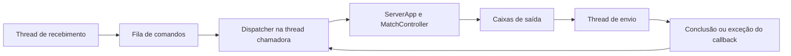

# Guia de implementação do servidor

A lógica da partida, o dispatcher sequencial e a comunicação por callbacks com
threads estão implementados. O transporte TCP **da partida**, o protocolo TVP/1
e seus temporizadores continuam pendentes em `TODO[EP-REDE]`.

As regras estão em [00-contexto-geral.md](00-contexto-geral.md) e
[02-boilerplate-servidor.md](02-boilerplate-servidor.md). O diagnóstico TCP local
é uma ferramenta separada: não implementa o protocolo ou a comunicação do jogo.

## Fluxo implementado

| Arquivo | Responsabilidade atual |
| --- | --- |
| [models.py](src/tetris_shared/models.py) | Comandos, participantes, eventos e resultados tipados; dataclasses imutáveis. |
| [rules.py](src/tetris_shared/rules.py) | Validações do jogo e constantes reservadas para a rede. |
| [match.py](src/tetris_server/match.py) | Dois jogadores, prontidão, encaminhamento, validação e resultado único. |
| [app.py](src/tetris_server/app.py) | Despacho sequencial, registros, caixas de saída e falhas de entrega. |
| [communication.py](src/tetris_server/communication.py) | Uma thread de recebimento e outra de envio, coordenadas por filas e callbacks. |
| [network.py](src/tetris_server/network.py) | Montagem do coordenador e stubs do transporte TCP da partida. |
| [network_diagnostic.py](src/tetris_server/network_diagnostic.py) | Troca TCP local de bytes predefinidos, com duas threads. |
| [simulation.py](src/tetris_server/simulation.py) | Oito cenários independentes com objetos em memória. |
| [__main__.py](src/tetris_server/__main__.py) | Seleção dos modos `simulated`, `network` e `network-test`. |



Somente o dispatcher altera estado e resultado. Os estados seguem
`WAITING → PREPARING → PLAYING → FINISHED`. Falhas ou parada planejada também
podem finalizar antes de PLAYING. O primeiro encerramento válido determina o
resultado imutável; falhas posteriores de entrega não o modificam.

`NetworkServer.prepare_communication()` monta `CommunicationThreads` sem abrir
sockets nem iniciar threads. `CommunicationThreads.run()` inicia as duas threads
e mantém o dispatcher na thread que o chamou. Cada coordenador executa uma vez.
O modo `network` ainda não chama o coordenador: falha explicitamente com o TODO.

O callback `receive(stop)` retorna um `Command` ou `None` ao encerrar a fonte.
Deve observar o sinal de parada e interromper esperas. A fila de entrada é
limitada e aplica contrapressão. O callback `send(event)` deve terminar ou lançar
uma exceção; o dispatcher aguarda sua conclusão antes de continuar. Isso preserva
a ordem e permite tratar falhas via `ServerApp.deliver()`, sem garantir entrega
remota. Fim da fonte antes do resultado gera `Command('stop')`.

## Onde implementar TCP da partida

Use `socket` da biblioteca padrão, com `AF_INET` e `SOCK_STREAM`, em
[network.py](src/tetris_server/network.py). Não coloque sockets no domínio.

| Método pendente | Implementação necessária |
| --- | --- |
| `NetworkServer.run()` | Criar o listener com `bind()` e `listen()`, coordenar admissão via `accept()`, preparar a comunicação, executar o dispatcher e fechar os recursos ao terminar a única partida. |
| `NetworkServer.receive_command(stop)` | Observar as duas conexões, preservar leituras parciais, validar mensagens, associar sessões confiáveis e devolver comandos ou fatos de falha. Observar `stop` e não bloquear indefinidamente. |
| `NetworkServer.send_event(event)` | Localizar a conexão do destinatário, codificar o evento, preservar bytes não enviados e cumprir limites e prazos. |
| `encode(event)` em [protocol.py](src/tetris_shared/protocol.py) | Produzir ASCII TVP/1 terminado por LF; BOARD contém exatamente 200 dígitos. |
| `decode(frame)` | Validar gramática, direção e campos e produzir entrada tipada; a sessão vem do adaptador, nunca do cliente. |
| `StreamParser.feed(data)` | Guardar fragmentos e extrair todas as linhas completas; limitar linhas e fragmentos a 512 bytes incluindo LF. |

O recebimento precisa observar ambos os sockets sem esperar indefinidamente por
um jogador; I/O não bloqueante e `selectors` podem ajudar. Não crie threads que
alterem livremente a partida. A preparação atual não implementa buffers de bytes,
prazos de rede, associação de conexões ou admissão.

### Ordem sugerida de implementação

1. Implementar codec e framing em `protocol.py`, com testes de fragmentos,
   múltiplas mensagens por leitura, ASCII inválido e limites de tamanho.
2. Criar listener e reservar no máximo duas conexões, inclusive aguardando HELLO.
   Fechar uma terceira sem mensagem extra. Criar referências opacas de sessão.
3. Exigir HELLO inicial válido; liberar reservas não identificadas que falharem,
   sem cancelar outro jogador. Participantes identificados não são substituídos.
4. Implementar recebimento e envio por callbacks e iniciar o coordenador.
   Preservar ordem de GO, ataques e resultados; substituir somente snapshots
   ainda não serializados. Não substituir bytes parcialmente enviados.
5. Implementar limite de saída de 4096 bytes por conexão e falhas de I/O.
   Entrada inválida de participante identificado exige PROTOCOL; apenas registrar
   `DomainError` não aplica automaticamente essa política no adaptador.
6. Implementar HELLO em até 5 s, KEEPALIVE a cada 5 s após HELLO, sem eco imediato,
   e TIMEOUT após 15 s sem mensagem completa válida. Usar relógio monotônico.
7. Após resultado, tentar escoar notificações por até 1 s, sinalizar parada,
   encerrar threads e sockets. Testar comunicação real entre dois participantes,
   recusa do terceiro, falhas antes/depois da identificação e escritas parciais.

| Entrada aceita do cliente | Comando local |
| --- | --- |
| HELLO | `Command('join', session, nickname)` |
| READY/PLAYER | `Command('ready', session)` |
| BOARD | `Command('board', session, rows)` com matriz 20×10 |
| ATTACK | `Command('attack', session, quantity)` com inteiro 1, 2 ou 4 |
| KO | `Command('ko', session, cause)` |
| KEEPALIVE | Controle de atividade no adaptador, sem comando de jogo ou eco imediato |
| Desconexão, timeout ou violação | `Command('failure', session, reason)` para participante identificado |
| Parada planejada | `Command('stop')` |

Esses comandos internos não são tipos extras de mensagem. Física, pontuação e
aplicação de lixo pertencem ao cliente, ausente deste repositório.

## Modos de execução

```bash
PYTHONPATH=src python -m tetris_server --mode simulated
PYTHONPATH=src python -m tetris_server --mode network
PYTHONPATH=src python -m tetris_server --mode network-test --port 5000
PYTHONPATH=src python -m unittest discover -s tests -v
```

| Modo | Threads e comportamento |
| --- | --- |
| `simulated` | Thread principal; oito cenários locais, sem sockets ou bytes de protocolo. |
| `network` | Transporte pendente; imprime `TODO[EP-REDE]` e retorna 2, sem simulação alternativa. |
| `network-test` | Principal coordena uma thread de recebimento e outra de envio. Abre listener TCP em `127.0.0.1`, conecta um cliente local e envia três blocos. Acumula leituras parciais, compara 54 bytes, imprime o fluxo e termina. |

Use `--port 0` no diagnóstico para escolher uma porta livre. Porta inválida,
ocupada, sockets proibidos ou troca incompleta resultam em erro e código 2.
O diagnóstico não usa TVP/1, não identifica jogadores e não inicia partida.
Não copie sua admissão simplificada para o transporte do jogo: ele aceita apenas
um cliente de diagnóstico e não implementa as políticas da partida.

## Simulações e validação

Cada cenário cria sua própria aplicação e injeta comandos reais no domínio.
`complete_match` identifica dois participantes, confirma prontidão, encaminha
ataque e snapshot e finaliza por KO/SPAWN de player1: player2 WIN/KO e player1
LOSE/KO. As demais simulações cobrem terceiro participante, prontidão repetida,
ambas as ordens de KO, saída antes/depois do jogo, entradas inválidas e falha de
entrega após resultado. Nenhuma delas transmite bytes.

Os registros mostram estado, participante, ocorrência e motivo. Um registro de
saída indica evento enfileirado, não entrega remota. `reason=-` indica ausência
de motivo naquele registro; o resultado completo está no payload de GAMEOVER
e no `MatchResult`.

A suíte contém 41 testes: domínio, dispatcher, threads, stubs e diagnóstico.
Quatro testes de integração exigem sockets locais e são ignorados explicitamente
se o ambiente os proibir. Na validação disponível, 37 testes passaram e esses
quatro foram ignorados; a troca TCP real ainda precisa ser validada em ambiente
com sockets permitidos. Preserve regressões do domínio quando substituir os stubs.
